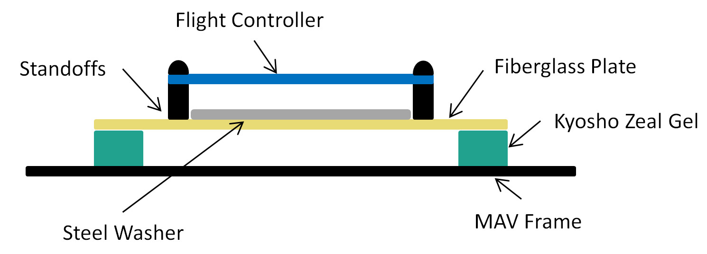
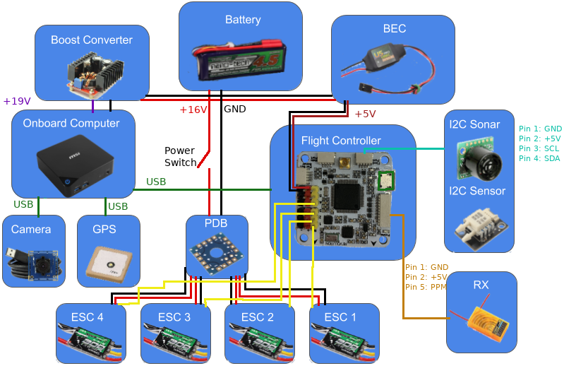

# Parts list

To use ROSflight to its full potential, you will need the following parts on your MAV (Minature Aerial Vehicle).  ROSflight supports both multirotor and fixedwing vehicles.

1. Aircraft Frame, Motor(s), ESC(s), Battery and Propeller(s)
2. Flight Controller (FC)
3. Any external sensors
4. Vibration Isolation for FC
5. Onboard Computer
6. Wi-Fi Router and Dongle
7. RC transmitter and receiver
8. Laptop or base station computer
9. Joystick (Xbox controller)

## Frame, Motors, ESCs, Battery and Propeller

We do not officially support any specific multirotor or airplane frame, motor, ESC, Battery or Propeller combination.  There are a lot of great resources for building your own MAV, and there are a lot of great kits out there that have all of these parts.

If you are designing your own multirotor or airplane, you may want to look at [ecalc](https://www.ecalc.ch/), an online tool which can help you design a proper ESC/Battery/Motor/Propeller system for your MAV.

Some things to keep in mind as you design or build your MAV.

* Most kits do not include space for an onboard computer, cameras, laser scanners or other sensors.  Be sure to think about where these components are going to go, and how their placement will affect the CG of the MAV.
* You will likely also need to customize the power circuitry of your MAV to provide power at some specific voltage to your onboard computer.  Many people like to separate the power electronics (The ESCs and motors) from the computer and onboard sensors.  This can really come in handy if you are trying to develop code on the MAV, because you can have the computer on and sensors powered, and not worry at all about propellers turning on and causing injury as you move the aircraft about by hand.  We will talk about this more when we talk about wiring up your MAV.
* Cheap propellers can cause a huge amount of vibration.  Consider buying high-quality propellers, doing a propeller balance, or both.  RCGroups, DIY Drones and Youtube have some awesome guides on how to do propeller balancing.
* ESCs will need to be calibrated from 2000 to 1000 us

## Flight Controller

ROSflight is best supported on the flip32+ from [readytoflyquads.com](http://www.readytoflyquads.com/the-flip32-187).  It works on any variant of the naze32 flight controller, but the flip32 has the convenience of having through-hole boot pins.  The naze32 and flip32 have identical schematics, they differ only in the layout of the board. We have seen some problems using off-brand versions of the naze32 or flip32 because there are fake versions of accelerometers which can mess with the firmware; try to avoid those if you can.

## External Sensors

Additional Sensors you may want for your ROSflight setup include:

* Sonar – MB1030 – [$25 on MaxBotix](https://www.maxbotix.com/Ultrasonic_Sensors/MB1030.htm)
* GPS – u-blox NEO-M8N – [$35 from Drotek](https://drotek.com/shop/en/511-ublox-neo-m8-gps-module.html)
* Digital Airspeed Sensor – [$65 on JDrones](http://store.jdrones.com/digital_airspeed_sensor_p/senair02kit.html)

The I2C sonar (MB124X) is also supported, but PWM sonars are preferred.

## Vibration Isolation

It is really important to isolate your flight controller from vibrations from propellers and motors.  We recommend using small amounts of [Kyosho Zeal](https://www.amazon.com/Kyosho-Z8006-Vibration-Absorption-Sheet/dp/B002U2GS2K/ref=sr_1_1?ie=UTF8&qid=1490068378&sr=8-1&keywords=kyosho+zeal) to mount a fiberglass plate holding the FC to the MAV.  You may also want to try adding mass to the flight control board.  We have accomplished this by gluing steel washers to the fiberglass mounting plate.

  

You may need to experiment with the amount of gel you use, how far apart the gel is spaced, and the amount of mass added to the flight control board.  The interaction of these factors is difficult to predict, therefore it takes a little bit of experimentation to get it right.

## Onboard Computer

The only requirement for the onboard computer is that it runs Linux 16.04, ROS, has at least one USB port, and can be carried by the aircraft.  We have had success with the following onboard computers, but by no means is this a comprehensive list, it is more by way of suggestion.

* MSI CUBI – i7-5500U – [$350 on Amazon](https://www.amazon.com/MSI-Intel-Support-Barebones-Cubi-028BUS/dp/B011Q6BBMW/ref=sr_1_6?s=electronics&ie=UTF8&qid=1490068829&sr=1-6&keywords=i7+NUC)
* GIGABYTE BRIX Gaming- i7-4710HQ/GTX 760 – [$850 on Amazon](https://www.amazon.com/dp/B00OJZVGFU/ref=cm_sw_su_dp)
* Intel NUC Skullcanyon – i7-6770HQ – [$570 on Amazon](https://www.amazon.com/dp/B01DJ9XS52/ref=cm_sw_su_dp)
* ODROID-XU4 – Exynos5 2GHz 8-core – [$77 on Ameridroid](http://ameridroid.com/products/odroid-xu4)
* ODROID-C2 – Cortex A53 2GHz 4-core – [$42 on Ameridroid](http://ameridroid.com/products/odroid-c2)
* Rasberry Pi 3 – Cortex A53 1.2GHz 4-core – [$36 on Amazon](https://www.amazon.com/dp/B01CD5VC92/ref=cm_sw_su_dp)
* NVIDIA Tegra TX1 - Cortex-A57 4-core CPU, 256-core Maxwell GPU - [$435 from NVIDA](http://www.nvidia.com/object/embedded-systems-dev-kits-modules.html) (Educational Discounts Available)

## Wi-Fi

You will need Wi-Fi to communicate with your MAV when it is in the air.  ROS communicates over TCP, so it is really easy to use ROS to view what is going on in your MAV while it is flying, send commands and read sensor data.  For most applications, a standard Wi-Fi router and dongle will suffice.  For long-range applications, you may want to look into [Ubiquiti](https://www.ubnt.com/) point-to-point Wi-Fi.  (We have seen ranges over a mile with these networks)

## RC Transmitter and Reciever

For RC Control, you will need a transmitter with between 6 and 8 channels.  Any additional channels will be wasted.  We require RC control for safe operation, and only support arming and disarming via RC control.

As of version 1.0, ROSflight only supports PPM (pulse position modulation) receivers. Support for serial RC (Spektrum Sattelites) is expected in future releases. A recommended RC setup is described below, but is meant as an example. Any configurations with PPM and 6-8 channels will be sufficient.

* Transmitter – [Spektrum DX8 $300 at Horizon Hobby](http://www.horizonhobby.com/dx8-transmitter-only-mode-2-spmr8000)
* Receiver – [Orange Rx 8Ch PPM $22 on HobbyKing](https://hobbyking.com/en_us/orangerx-r820x-v2-6ch-2-4ghz-dsm2-dsmx-comp-full-range-rx-w-sat-div-ant-f-safe-cppm.html/?___store=en_us)

## Laptop or Base Station Computer

You will need a laptop which can run Ubuntu 16.04 and ROS to communicate with the MAV over WiFi.  If you are new to Linux, I would recommend dual booting your computer rather than using VirtualBox.

## Joystick

The Joystick is not technically a required component, because it is possible to control your MAV over command line. It does make things easier, however.  We recommend XBOX 360 controllers and have default parameters set for the XBOX configuration.  Other joysticks are supported, but you may need to perform custom axis and button mappings.

# Wiring diagram

Below is an example wiring diagram for a multirotor using a MSI Cubi as an onboard computer.  This diagram also includes the motor power switch, which allows for the sensors, flight controller and onboard computer to be power on while the motors are off.  This is a safer way to work on the aircraft as the motors are unable to spin while the switch is off.

Your needs will likely be slightly different than what is shown.  This is meant as an example only and can be adapted to fit your needs.

# Motor layouts

The desired mixer can be chosen by setting the the "MIXER" parameter to the following values:

| # | Mixer |
|---|---------|
| 0 | ESC calibration |
| 1 | Quad + |
| 2 | Quad X |
| 3 | Hex + |
| 4 | Hex X |
| 5 | Octo + |
| 6 | Octo X |
| 7 | Y6 |
| 8 | X8 |
| 9 | Tricopter |
| 10 | Fixed wing (traditional AETR) |

The associated motor layouts are shown below for each mixer.
The _ESC calibration_ mixer outputs the throttle command equally to each motor, and can be used for calibrating the ESCs.

# Important Mixer Setup Tip

Refer to the table below to ensure motors and servos are connected to the proper channel on the naze. In the Mixer Layout column, M refers to Motors, S refers to servo, and N refers to not connected. Channel 1 is the far left item in the Mixer Layout Column.
 
| Mixing | Mixer Layout |
|--------|--------------|
| Quad-Plus | {M, M, M, M, N, N, N, N} |
| Quad-X | {M, M, M, M, N, N, N, N} |
| Hex-Plus | {M, M, M, M, M, M, M, M} |
| Hex-X | {M, M, M, M, M, M, M, M} |
| Octo-Plus | {M, M, M, M, M, M, M, M} |
| Octo-X | {M, M, M, M, M, M, M, M} |
| Y6 | {M, M, M, M, M, M, N, N} |
| Y8 | {M, M, M, M, M, M, M, M} |
| Tricopter | {M, M, M, S, N, N, N, N} |
| Fixed Wing | {S, S, M, S, S, M, N, N} |
